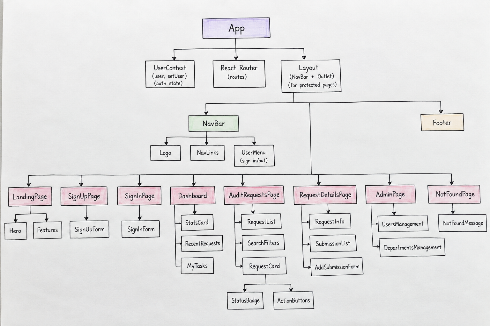

# AuditFlow-front-end

AuditFlow is a full-stack MERN application that helps companies manage internal audit requests in one place, replacing scattered emails, spreadsheets, and files. Auditors create and assign audit requests to employees, employees submit evidence or comments in response, and auditors review each submission — approving it, rejecting it, or requesting changes. Admins and managers oversee users, departments, categories, and overall audit progress through a dashboard.

## User Stories

1. **User:** As a user, I want to sign up and sign in so that I can securely access AuditFlow.
2. **User:** As a user, I want to sign out so that I can securely end my session.
3. **User:** As a user, I want role-based access so that I can only view and perform actions allowed for my role.
4. **User:** As a user, I want to see the status of an audit request so that I know whether it is pending, under review, completed, rejected, or overdue.
5. **User:** As a user, I want to search and filter audit requests so that I can quickly find the requests I need.
6. **Auditor:** As an auditor, I want to create a new audit request so that I can request information or evidence from an employee.
7. **Auditor:** As an auditor, I want to assign an audit request to an employee so that the correct person can respond to it.
8. **Auditor:** As an auditor, I want to add a deadline and priority to an audit request so that important requests can be handled on time.
9. **Auditor:** As an auditor, I want to view all audit requests so that I can track their progress.
10. **Auditor:** As an auditor, I want to edit or delete an audit request so that I can correct or remove requests when needed.
11. **Auditor:** As an auditor, I want to review an employee's submission so that I can decide whether it meets the audit requirements.
12. **Auditor:** As an auditor, I want to approve, reject, or request changes to a submission so that the audit request has a clear outcome.
13. **Employee:** As an employee, I want to view audit requests assigned to me so that I know what information I need to provide.
14. **Employee:** As an employee, I want to submit evidence, information, or comments for an audit request so that the auditor can review my response.
15. **Employee:** As an employee, I want to update my submission when changes are requested so that I can complete the audit request correctly.
16. **Admin/Manager:** As an admin, I want to manage users and their roles so that employees and auditors have the correct access.
17. **Admin/Manager:** As an admin, I want to manage departments and audit categories so that requests can be properly organized.
18. **Admin/Manager:** As a manager, I want to view a dashboard showing pending, completed, overdue, and rejected requests so that I can monitor overall audit progress.

## Getting Started

- **Deployed App:** [PLACEHOLDER_DEPLOYED_APP_LINK](PLACEHOLDER_DEPLOYED_APP_LINK)
- **Planning Materials:**
  - [ERD](https://viewer.diagrams.net/?tags=%7B%7D&lightbox=1&highlight=0000ff&edit=_blank&layers=1&nav=1&title=Untitled%20Diagram.drawio&dark=0#R%3Cmxfile%3E%3Cdiagram%20name%3D%22Page-1%22%20id%3D%223UvyFxL5jQ96tQXZC3CF%22%3E7Z1rc9o4F8c%2FTWaaF8n4wvUl1zbTps1y2efZVx0HC%2FDW2FQWTeinX8kXsMEix4ATkZ6U2cVClmzrp6O%2FdGTpyuwsnj9Sazm%2F923iXhma%2FXxldq8Mw6g3a%2Fx%2FImQdhegNoxGFzKhjx2HbgKHzm8SBWhy6cmwSZCIy33eZs8wGTnzPIxOWCbMo9Z%2By0aa%2Bm811ac3IXsBwYrn7of9zbDaPQhtVbRv%2BiTizeZKzrsW%2FLKwkchwQzC3bf0oFmb0rs0N9n0XfFs8d4oqnlzyX6Ly%2B5NfNhVHisZwTxgGh3x7%2FFc%2FE0FzrkRdMGCm%2BOkIXlmN3LWbFwfX2lcELy%2BQP3uRftfBT%2B7kSl9e2RbzN0ZXZyvxKaNexZtRaXFU7XnKq%2BHR7D63B6L73dSSO6x3%2Bubnxw6y08bA3EKFRWtXONjlKpoTf1IQXu6F9EPdxaxN%2Bn2zB7%2FSah%2FU%2FZ%2BLv5pqknM2vNe7ejb4Pen%2BNe8MRJOMJJRYjdnsdptoXPAWBM%2FOIPfIBV3Ho3gtfS6H730s9m%2Flw3L6%2FGw7vvn3Nz5ksHokd5tpa2Q4bkJ8rErDbYPW4cPgD8L3gqsrz7F7vX4SsIPYuMf2JIL2z%2Bdfvjvjvw%2BdD0QNGHW%2FGv6w4GJ61IKDIhNPugmIueSk%2F%2BdT%2BZAVz0AnUdw9eQ%2Br%2BtsWYlGL2rHo37zHukFTKwwQ%2FSG6MJ9RZMs4B8PL3cSzlDpjDDpcD6Bby4gfMYqsABg91fOqw9aHI3JaS8Cos23U8KDppa5RDTv5JW4NV5KzjKM2alXLKeOIvxGXByoL84sqBG9AxhVX8l4s5ddmhNWSwAokLfHNKi%2BU90q0lNToHWmKuc6bObLct9lZCG2xPqkct%2FUYstAd1j9Q%2FeU8PdDX9t8p6ffp4o9c3KmSjLmIZZT0m%2Bkfblxmx8gjYOok0o%2F5qyfNl1PKCKGrbX3m20F66aFJ4O3LHk44PXX%2Fyg9gfo5O64oLDBB4s2xZFwSNFdy5y%2BUUoI8%2BpjOPr%2FUj8BWF0HVIeX8UmaKuC%2BJf43pLDlC46qJPSVjelmO7iJ8rvpSWJ0rYCMtw%2BHK77luJr%2FFDbnDPKYqFbMaMiZRa3BDR%2BPBPfda1l4ERlIB7FZO649hdr7a9YklBy1J46z8QeRDpXnM0l7xeeWHI45YnHmem1%2BLhvLRxXCPIRJY%2BryZyIW78fcvD%2BJtS2PC71Oi3qWByITsBL9IY%2FImcaXjr1f2x0sEjecrmB4d8nvMjFDXDdEvDcvlgBi2PM2cJNrsVx3Y7v%2BuJGXaGZb2yL%2FvjAqe11ep1%2BPyTf1KeGZmjXm%2Bzyz2iada0b1RVzEv5dx3eXHz%2F6242%2FV25%2FW%2B6K5ANwuC419utSus4cqICZmoSwqA4LwCDN0x3Cetzjetr2Hg2zGoUlyTRikxp3kmv12OqeZtn2uoz5EDb3LfwBxOW0DkTntj3n%2Bue3YNSNcUwTHB4%2FOQvX8niv2bJ3gtp%2BOExwuPSn4d%2Fh0ne8OYeQ5UK4X2Fs6i9HFp0RFgcsfUeIDH6LoqPT5oXR0W6rvMsjcq229e0x%2F4jolHPk8ax4xRRpEA70ExFQt5mfNHEumSbp0xgP8f3RZ8xfxAdHEcbNghSwdTZKAZ5g8OTJg4OU5cAjxCY3HwMhO7xZaPWyKkTb4cHzPXJUhd%2BHoagJOMkgRizoWxb0dPnrKTDSxjKK2%2BayasLF0ZfozAYP8TknUzccUZo7Npe6OQY8BmrbqG0l7HlIa9TlZMWJbQu2cGqWy0Qfn5FYTe7iurnOEwjOGUdDghUmOOwwngdeXcu2w%2BeFeZP6a9JsIM0XRfPD53PBnAQliTSNc8K8qyBeg2XzsoRpX%2Bf%2FXuiWoDDNCtNGrSxhWgHCk1CGhvBtDWEyDIuyNMKyivxeFL%2BhAw11qYzSGuJ8UTijKpUBWr8sVYrDpcVVqW40y5KlDagdlLuG0A6iLH0zWQp1FiG%2FavCbnuuE6lQCqwn1YiHValD9B6pT2TSlaI6tZILS3o84NenCZpvkT03aluthu5auFTgp6R1jUtAUmpq%2B3wmqZpv1pFGM%2B0TNmi63jeeek2RC3Zjm%2FlxU7GQr2smuvtKcJBPqN0woQzWHc5KU6mWbUOclEqwGweeck2SU2rs23qB3DXVlIs1q0FzanCSOn7L9ayDLUD%2BmIsIU5yQVF6alzUkyoa7DhDI0hOj8UUmWQp2XyK8a%2FG5WSEBtKiMV6s9EpNVAGpWpBNAK1IepiDLFIdPiyrS8eUkV6FtwCWZoB1GaKiRNK1CHEfKrBr%2FRelyoS2WYQn1YyLMaPKMulQEK9mWpoUtxxPQIXVo%2FQOlpuhTqO0owQzuIulQlXQr1FyG%2FavCbWf0V5amMVqgnC7FWA2uUpzJAwT4tNeQpDpsWl6eGXpVTepo8hbqPKvKXgdEOojx9K3lahTqNkF81%2BA33GkBZKsMZ7MVCnJXAGWWpjGSoP0sRWYqjpkfI0mqjJFlahXqPEszQDuIbUGoJU6jXCAlWg%2BD0nkEoTyWsQp1ZCLUaUPf%2FxBehZAuN7GzjJvLLWXFEHguXHrmwNSXylx7JKeDDRq%2BWYhrXIHnHvBS2ktp%2BFymZzpYkU29kuky6meyU9BqrkFShXs6q%2FOUQ9A0p1gmvZJe1KW0VkirUsVjFNeWUEHvYB98FE%2BrcRILVIPicq5Do2Yb4zJ1vXXt1mmtQVyfSrAbNJe6MdFaY38A7VIP6ORURpugdKi5MS1uFpAZ1LdbkrkU0hDhn6a1kaQ3q3ER%2B1eCXOeyMk5benzCFujqRZzV4RlkqAxTs31RDluJ4aXFZWt4SJDXoq3IJZmgHUZeqpEuh3iLkVw1%2By9ga6f2pU6gbC6lWg2pUpzJAwe4sNdQpDpoeoU5LW4ikDnUfJZihHUR1qpA6rUNdRsivKvxabBWgMJUCDXZjIdBKAI3CVEYy%2BG09NYQpDpsWF6blLUFSh7qPEszQDr51w47CNI0l1GmE%2FKrB75I6vIVha5SmUlKhnixEWg2kUZrKAL2wN6BwzPQIaVraMiR1qO%2BojlPulbCDNjcmKEwTKKH%2BIqRXEXp5o%2BE6Hk41lZLagDqxEGk1kEZhKiP5wt6AwjHT4sLU1Iqv9QCkB%2Bo7auCUeyXsIL6bvwsm1GeEBKtB8IQSDoTdxmFTOapQTxYyrQbTpS2P9w706YW9CoUDp0fo02Rzo%2FPrU6gDqYGT7pWwhKhPd8GEOo6QYDUItoKAJ0vskY8CVcoq1J%2BFUKsBNQpUOaIX9jYUDqAeIVAPmdyTBGoT6khKMENLiAJVKYHahDqQkGA1CC5hg5F3J1CbYL8WQq0E1H%2BkQJVtMDIct%2B%2FvhsO7b1%2BjzHJ2F5FEwa1FLmyriPytRXZL97CtM1Mo474i7xiWgsZxM20k0zOqZM1j8opGsm5E09Tk9vLc%2B4o0oY7Opvz9EOx7q9b3rmSIKm1fkSbUs5hQhhoPu95qdb2h3k0kWA2Cz7qvSLYhPnefu%2FL6NEM9nUizGjSXtq%2BIcWi%2B8kU4hZpQB6ciwhRnLRUXpqXtK9KEehQTytAQ4kIkCslSXYM6NRFgNQCe%2BAvhDwpQnMqZhro5kWk1mEZtKkUZ6txURJziqGlxcVre7iK6Bn1jbgMamkLUp0rpU6jbCAlWhGDyy%2BExJ2RMXdSoclqhHi3kWhGuUaRKCQX7ttQQqTiCeoRILW2TEV2DOpM2oKEpRJGqlEiFupCQYGUIPu9GI%2B9Pn0IdW4i0IkijPpURqoN9XGroUxxELa5Py9trRNeh7qQNaGgKcfapWgpVh%2FqRkGFFGA5WjwuHnXn1vHcnU3Wwgwu5VoPr0t7%2BfA9C9cLekcKB1COEamk7j%2Bg62Kek47R8JYwh7j2SoRLqR0J%2BFeF3I1JbZ1yg5P2JVLCDC7lWg%2Bs%2FUKLKFii5Mmo%2FV754tpRMCRUze3jK2gcR%2F3a7PtE1DxPSPokcXdnOaib86ba6vYfWYHTf%2Bzq64bFnIu542BtwfrTMOTvLm0xW9Bex40IPdWyL0rBUe4OF5dnfYti3ApfXJbNNPHsb7zeh%2Fsi%2Ft7x19Es64qFqkg%2F5fjVJLyuRIkwkHz7QtjX5MaOibCRyutHv9zqVbpSTYYl%2Fle7JFapo7SXPDvu%2FMCi3YeUQh%2F%2FEt8ULmq6j36rJ4T8ZwZy%2FyMlJEL1gXBupyhObY2LPSKraFlkjxV%2FRCTkUcf%2BVAURTdTTDGyN2BlSW9DJlJW1KTD4lrsWcX1nApAadF7G1TkWI%2B7PblB9EwLaJ0JPuYdxdbMbT%2F7Z2PEoRaNVzlmspauhTm3ho4jrEvSTLJoOtvjDxG3vfGnfvRt8Hvb%2FGveEIDb%2BCtasqr1xRxTvV8BeH6oVWoPmqrYC5vxkLcqo6p0e1AtFK0G%2FdCuim8dbNwHmkPpr%2BC65SZ5H8p6l9Q0O1j1CeX%2ByfbObhyyW%2BbHjJ4pHYYWVprWyHDcjPFQnYbTjYylWS7wWhM4wXyMs2OGNwN2Y4vego2uCLxh1mg49G6gVzrL%2BqOc7ZlgP5VJzPo8xxZp3jcs0xD6K%2Bz9JKmlrL%2Bb1vC8Pc%2Bw8%3D%3C%2Fdiagram%3E%3C%2Fmxfile%3E)
  - [Wireframes](https://excalidraw.com/#json=JSGmGi4BfHrTVhP4uofK1,WjoQ5OIN0KvCno4gkYJMHw)
- **Back-End Repository:** [AuditFlow-back-end](https://github.com/alnoohy/AuditFlow-back-end)

## Technologies Used

- React
- JavaScript (ES6+)
- Node.js
- Express
- MongoDB
- Mongoose
- JSON Web Tokens (JWT)
- bcrypt
- CSS (Flexbox / Grid)

## Front-End Routes

# AuditFlow - Front-End Routes

| Route | Page / Description |
| :--- | :--- |
| `/` | Landing Page |
| `/sign-up` | Sign Up |
| `/sign-in` | Sign In |
| `/dashboard` | Dashboard |
| `/audit-requests` | Audit Requests |
| `/audit-requests/new` | Create Request |
| `/audit-requests/:requestId` | Request Details |
| `/audit-requests/:requestId/edit` | Edit Request |
| `/audit-requests/:requestId/submit` | Submit Evidence |
| `/admin/users` | Manage Users |
| `/admin/departments` | Manage Departments |
## Back-End Routes

# AuditFlow - Back-End Routes

## AUTH

| Method | Endpoint | Description |
| :--- | :--- | :--- |
| **POST** | `/auth/sign-up` | Register a new user account. |
| **POST** | `/auth/sign-in` | Authenticate an existing user and return a JWT. |

---

## AUDIT REQUESTS

| Method | Endpoint | Description |
| :--- | :--- | :--- |
| **GET** | `/audit-requests` | Retrieve all audit requests (with search, sort, and role-based filters). |
| **POST** | `/audit-requests` | Create and assign a new audit request (Auditor/Admin only). |
| **GET** | `/audit-requests/:requestId` | Retrieve details for a single audit request. |
| **PUT** | `/audit-requests/:requestId` | Update an existing audit request (Auditor/Admin only). |
| **DELETE** | `/audit-requests/:requestId` | Delete an audit request (Auditor/Admin only). |

---

## SUBMISSIONS

| Method | Endpoint | Description |
| :--- | :--- | :--- |
| **POST** | `/audit-requests/:requestId/submissions` | Submit evidence, info, or comments for an audit request (Employee/Auditor). |
| **PUT** | `/audit-requests/:requestId/submissions/:submissionId` | Update a submission or review/update its status (Approve, Reject, Request Changes). |
| **DELETE** | `/audit-requests/:requestId/submissions/:submissionId` | Delete a specific submission. |

---

## USERS

| Method | Endpoint | Description |
| :--- | :--- | :--- |
| **GET** | `/users` | Retrieve all system users (Admin/Manager only). |
| **PUT** | `/users/:userId` | Update a user's details, role, or department (Admin only). |
| **DELETE** | `/users/:userId` | Deactivate or delete a user account (Admin only). |

## Component Diagram

## Next Steps (Future Enhancements)

- Email or in-app notifications when a request is assigned, updated, or nearing its deadline.
- Audit trail/history log showing every status change on a request.
- File attachments with previews (PDF/image) instead of a single evidence link.
- Exportable reports (CSV/PDF) for completed and overdue audits.
- Commenting/discussion thread on each audit request between auditor and employee.

## Attributions

- PLACEHOLDER_ATTRIBUTION_LINK_OR_NONE

